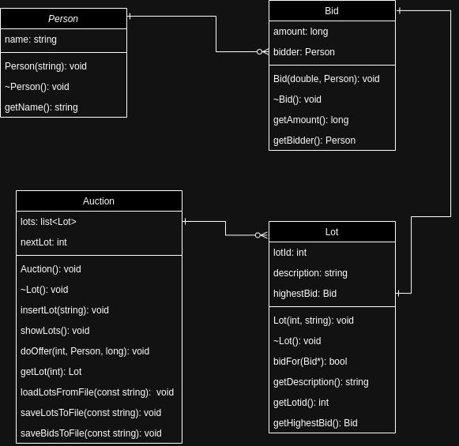

# Auction System

The Auction System is a software application that facilitates the buying and selling of items through auctions. This system allows people to submit bids for various lots, and the highest bid is recorded for each lot.

## Features

- **Lots:** An auction consists of a set of items offered for sale, which are called lots. Each lot has a unique number and a name.

- **Bids:** People can submit bids for the lots. A bid stores the amount and the bidder's information.

- **Highest Bid:** Each lot keeps track of the highest bid received.

## Class Diagram

The class diagram represents the structure and relationships between the classes in the Auction System. It provides a visual representation of the system's design.

## Implementation

The Auction System is implemented using object-oriented programming principles. The system is composed of the following classes:

- **Person:** Represents a person participating in the auction. It stores the person's name.

- **Bid:** Represents a bid made by a person for a specific lot. It stores the bid amount and the bidder's information.

- **Lot:** Represents an item offered for sale in the auction. It stores the lot number, name, and keeps track of the highest bid received.

- **Auction:** Represents the auction itself. It stores the collection of lots and the quantity of lots.

## Getting Started

To use the Auction System, follow these steps:

1. Clone the repository: `git clone https://github.com/your-username/auction-system.git`
2. g++ output auction-system.cpp

## Contributing

Contributions are welcome! If you find any issues or have suggestions for improvements, please open an issue or submit a pull request.

## License

This project is licensed under the [MIT License](/path/to/license-file).
